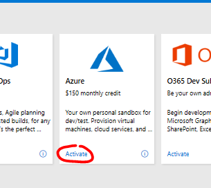

# Which Role Learning Outcome does this session support? 
1. Provide a higher quality integrated technology/solution implementation.  
2. Develop code and/or and integration tests to stabilize developed solutions using Microsoft methodologies in complex customer environments. 
3.Analyze trends and common themes across customers and anticipate potential challenges in implementation or operations. 
4. Design and architect solutions with carefully crafted iterated user stories  
5. Deliver a solution with a strong influence on the success criteria as outlined in the project plan  
---
# Learning Objectives 
1. Understand how to work with Azure, Git repositories and also work with branches, pull requests, merge, commit etc. 
2. Learn to create CI/CD pipelines for your Infrastructure as Code (IaC) content using Azure DevOps Pipelines by working with different build and release methodologies for your multi-tier application infrastructure.
3. Learn to integrate Azure DevOps with Azure Automation.
---
# Prerequisites
1. Github account. (Go to [github.com](https://github.com) to sign up)
2. git command line tool installed. [Download here](https://git-scm.com/downloads)
3. Azure subscription. (Go to [my.visualstudio.com](https://my.visualstudio.com), login, under the Azure Tool, click Activate, and continue)
 
4. Azure DevOps account. (Go to [my.visualstudio.com](https://my.visualstudio.com), login, under the Azure DevOps tool, click Get Started, continue)

---
# Understand how to work with Git and Azure together
Understand how to work with Azure, Git repositories and also work with branches, pull requests, merge, commit etc.
---
# Learn to create CI/CD pipelines for your Infrastructure as Code (IaC)
Learn to create CI/CD pipelines for your Infrastructure as Code (IaC) content using Azure DevOps Pipelines by working with different build and release methodologies for your multi-tier application infrastructure.
--
# Learn to integrate Azure DevOps with Azure Automation
